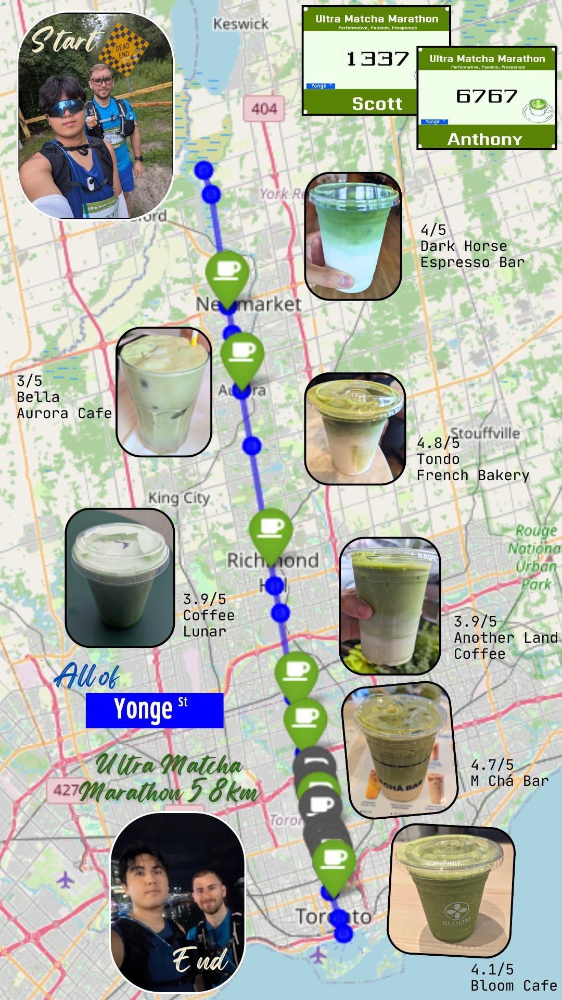

# Yonge Street Ultra Matcha Marathon 🍵🏃‍♂️🗺️

Combining three passions: **running**, **geospatial data engineering**, and **matcha**.

A 58 km self-supported ultramarathon starting at the northern terminus of Yonge Street in East Gwillumbury and finishing at Queens Quay along Lake Ontario in Toronto—hitting as many matcha cafes as logistically possible along the corridor.


---

## 📍 Route & Project Overview

* **Distance:** 58 km (Point-to-Point)
* **Start:** East Gwillumbury, ON
* **Finish:** Queens Quay, Toronto, ON
* **Primary Corridor:** Yonge Street

---

## 🛠️ Data Pipeline & Methodology

Before lacing up, a route and stop-selection workflow was built using the **Google Places API** and **OpenStreetMap (Overpass API)** to extract food and beverage amenities within a corridor buffer along Yonge Street.

The raw extraction returned ~40 candidate locations, which underwent practical spatial QA/QC:

* **Attribute Filtering:** Removed full-service restaurants (e.g., sushi bars) that merely listed matcha desserts or green tea on their menu.
* **Spatial Constraints:** Excluded indoor mall locations (e.g., Centerpoint Mall, CF Toronto Eaton Centre) that shared a Yonge Street address but introduced significant indoor navigation detours.
* **Temporal Routing:** Factored in operating hours—prioritizing northern locations opening early in the morning and southern downtown stops remaining open later into the evening.

This reduced the dataset to an optimized target list of **14 candidate stops**.

```overpass
[out:json][timeout:90];

// 1. Fetch Yonge Street ways across York Region & Toronto
way["name"="Yonge Street"]["highway"](43.60,-79.45,44.10,-79.35)->.yonge;

// 2. Search for food & beverage amenities within 50 meters
(
  node(around.yonge:50)["amenity"~"cafe|restaurant|fast_food|ice_cream|bubble_tea"];
  way(around.yonge:50)["amenity"~"cafe|restaurant|fast_food|ice_cream|bubble_tea"];
  node(around.yonge:50)["shop"~"tea|beverage|confectionery"];
  way(around.yonge:50)["shop"~"tea|beverage|confectionery"];
);

// 3. Output results
out center body;
>;
out skel qt;



